# DOCKER实验报告

姓名：洪燊

学号：17343042


## 实验环境

操作系统：Ubuntu 19.02

## 实验流程

### docker安装

1. 更新apt包索引

   ```bash
   sudo apt-get update
   ```

2. 安装apt依赖包

   ```bash
   sudo apt-get install \
       apt-transport-https \
       ca-certificates \
       curl \
       gnupg-agent \
       software-properties-common
   ```

3. 添加docker官方的GPG密钥：

   ```bash
   curl -fsSL https://download.docker.com/linux/ubuntu/gpg | sudo apt-key add -
   ```

4. 通过搜索指纹的后八个字符，验证指纹密钥

   ``` bash
   sudo apt-key fingerprint 0EBFCD88
   ```

5. 设置稳定版仓库

   ```bash
   sudo add-apt-repository \
      "deb [arch=amd64] https://download.docker.com/linux/ubuntu \
     $(lsb_release -cs) \
     stable"
   ```

6. 安装docker engine-community

   ```bash
   sudo apt-get install docker-ce docker-ce-cli containerd.io
   ```

7. 将当前用户添加进docker用户组

   ```bash
   sudo groupadd docker
   sudo gpasswd -a ${USER} docker
   sudo service docker restart
   ```

   注销当前用户并重新登陆

8. 测试docker是否安装成功

   ```bash
   sudo docker version
   ```

   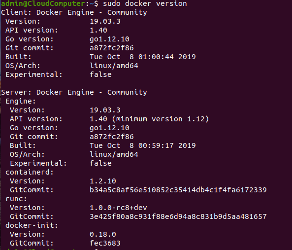

### 运行第一个容器

#### 运行镜像

```bash
sudo docker run hello-world
```

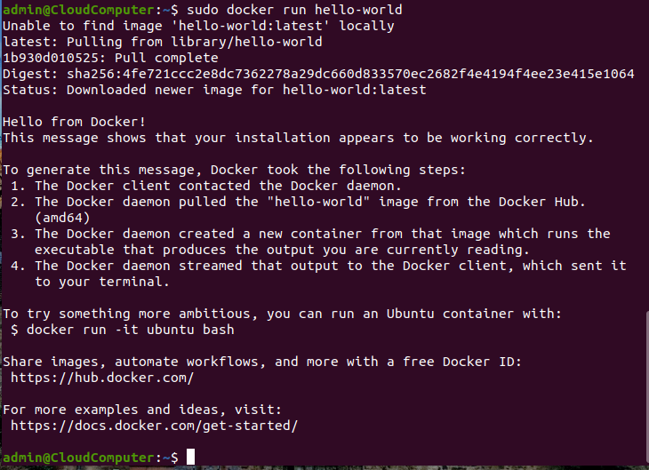

```bash
docker run -it ubuntu bash
```

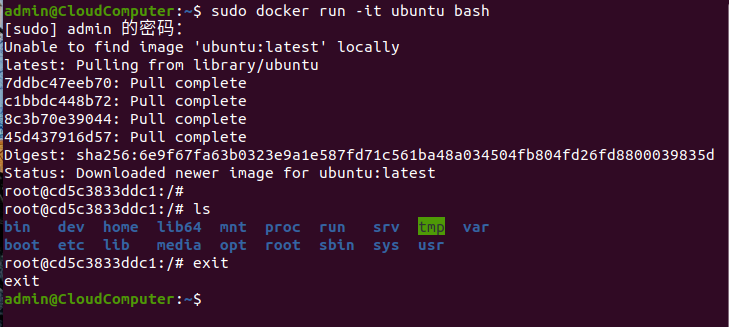

### 显示本地镜像库内容

```bash
docker images
```

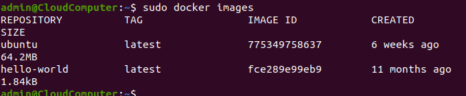

#### 获得帮助

```bash
docker --help
```

#### 显示运行中容器

```bash
docker ps
```

#### 显示所有容器（包含已中止）

```bash
docker ps -a
```


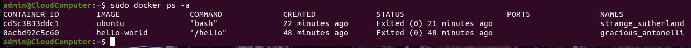

####  继续运行原容器并进入

```bash
docker restart [容器名]
docker ps
docker attach [容器名]
```

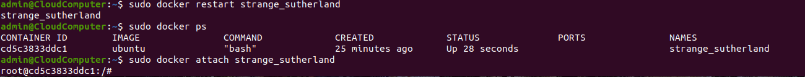

### MySQL与容器化

#### 拉取MySQL镜像并检查

```bash
docker pull mysql:5.7
docker images
```

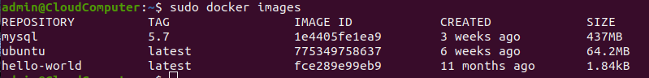

#### 构建docker镜像

在创建有有效dockerfile的文件的文件目录下执行

```bash
docker build . -t hello
```

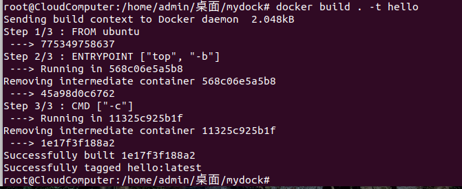

使用docker images查看，可以看到创建成功：

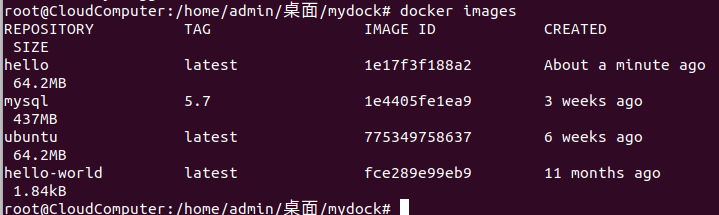

#### 运行创建的镜像

```bash
docker run -it --rm hello -H  
```

其中--rm参数让docker退出时还原到默认容器的文件系统内容，运行成功：

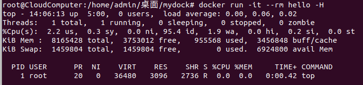

#### 使用MySQL容器

启动服务器

```bash
sudo docker run -p 3306:3306 --name mysql2 -e MYSQL_ROOT_PASSWORD=root -d mysql:5.7
```

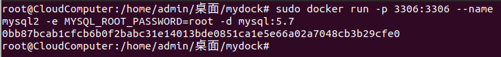

启动mysql客户端容器并允许mysql客户端

```bash
docker run -it --net host mysql:5.7 "sh"
```

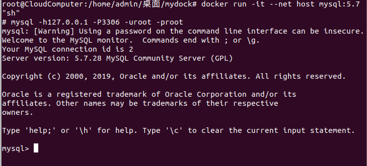

同时可以访问容器，查看数据库存放位置等等。

## 文章分享

[这可能是最为详细的Docker入门吐血总结](https://blog.csdn.net/deng624796905/article/details/86493330)


