# 服务计算第一周实验报告
## 1.实验目的
- 初步了解虚拟化技术，理解云计算的相关概念
- 理解系统工程师面临的困境
- 理解自动化安装、管理（DevOps）在云应用中的重要性
## 2.实验环境与要求
- 用户通过互联网，使用微软远程桌面，远程访问你在PC机上创建的虚拟机
- 虚拟机操作系统 Centos，Ubuntu，或 你喜欢的 Linux 发行版，能使用 NAT 访问外网。
## 3.实验内容
### 1.安装VirtualBox
在VirtualBox官网下载最新的VirtualBox，链接如下：
>https://download.virtualbox.org/virtualbox/6.0.10/VirtualBox-6.0.10-132072-Win.exe

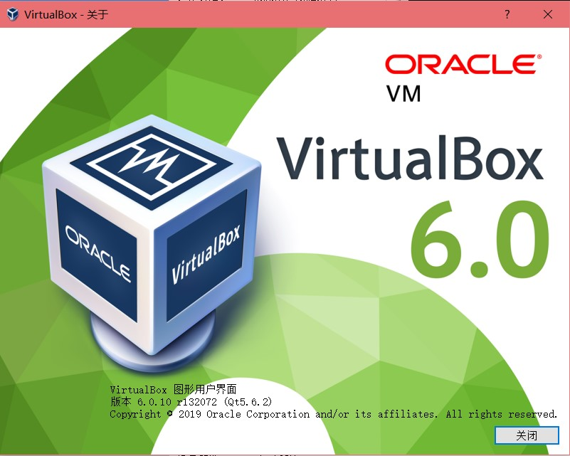   

### 2.创建Linux虚拟机
使用上学期操作系统实验的Ubuntu14镜像（vdi文件）创建虚拟机
点击创建后按步骤创建虚拟机：
#### 设定基本属性
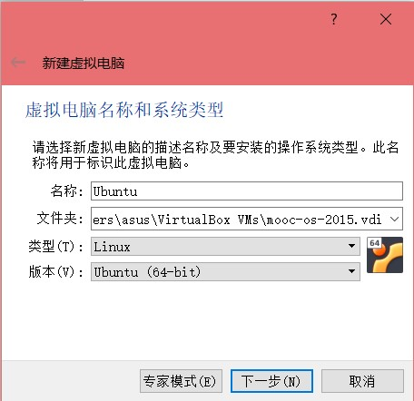 
#### 分配内存
 
#### 将已有vdi文件作为启动硬盘
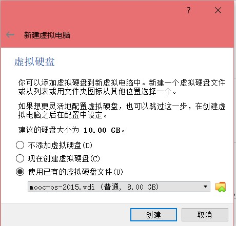 
### 3.配置远程桌面访问虚拟机
#### 1.主机网卡创建虚拟机网卡设置
在菜单栏->管理->主机网络管理器中设置一个Host-Only网卡，目的是以此作为媒介让虚拟机可以与主机通信
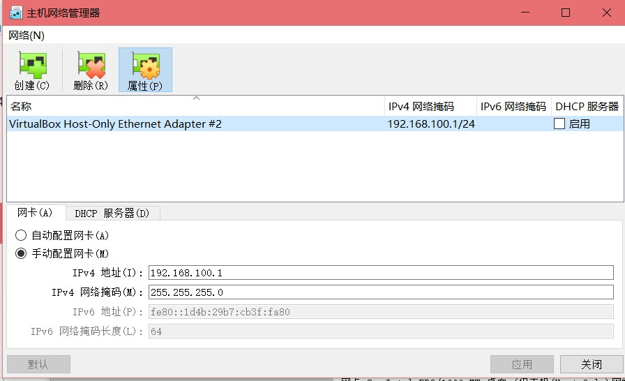 
#### 2.虚拟机网卡设置
在虚拟机菜单栏->设置->网络中设置网卡1和网卡2，其中网卡1的连接方式为NAT，目的是让虚拟机可以访问外网:
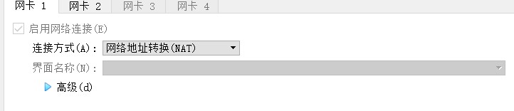
设置网卡2，连接方式为Host-Only，选择的网卡即为之前创建的主机网卡，为了让虚拟机可以和宿主机通信
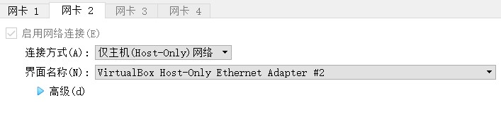 
#### 3.虚拟机与主机之间通信验证
在宿主机上ping虚拟机
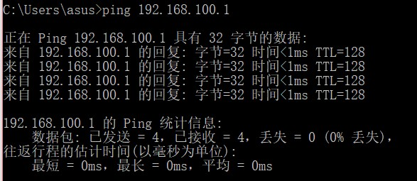 
在虚拟机上ping宿主机（此时主机ip为 172.19.11.32）
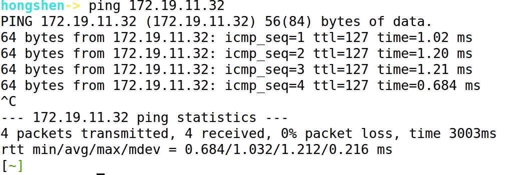
可以连通，验证成功
#### 4.安装Virtualbox拓展套件并开启远程访问虚拟机功能
套件下载地址如下：
>https://download.virtualbox.org/virtualbox/6.0.10/Oracle_VM_VirtualBox_Extension_Pack-6.0.10.vbox-extpack

套件安装：
菜单栏->全局设定->扩展，将下载的套件添加即可
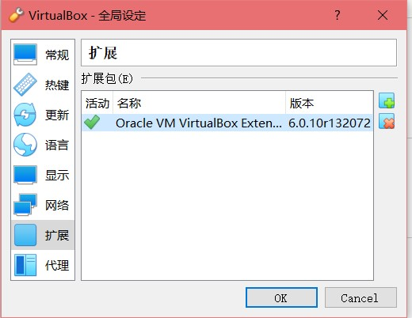
然后再虚拟机菜单栏->设置->显示->远程桌面启用服务器并设置服务器端口号，注意端口号不要与已经使用得发生冲突可以使用以下命令行指令查看某个端口号是否被占用

>netstat -aon|findstr "端口号"

这里设置端口号为5005
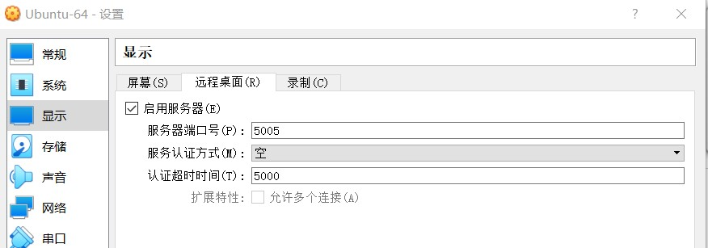

完成以上后重启

#### 5.远程桌面访问验证
打开远程桌面并输入本机ip与刚刚设置的端口号（这里为172.19.11.32:5005）
效果展示：
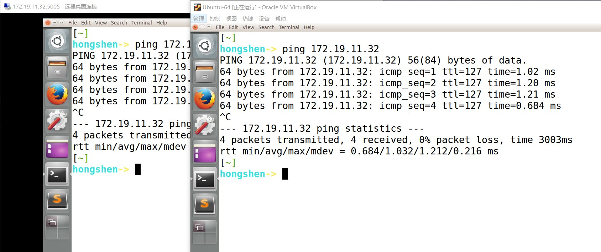

实验成功

#### 6.后续
安装基本的浏览器，sublime，以及中文输入法等就可以正常顺手地使用。

