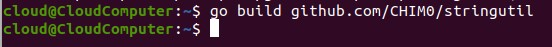
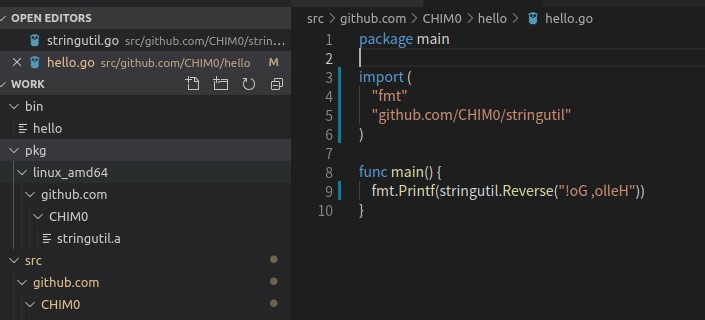

# 服务计算第三周实验报告
## 1.实验目的
- 了解go项目代码的组织形式
- 了解环境变量的运用

## 2.实验环境与要求
- 系统Ubuntu19
- go语言环境

## 3.实验内容
### 第一个程序
#### 1. 按流程建立工作文件夹，并将工作文件夹路径加入到环境变量中

#### 2. 在hello文件夹中建立hello.go文件

#### 3. 使用go工具安装并构建hello程序
  

可以看到工作目录下的bin文件夹生成了构建好的hello程序  

#### 4. 运行hello程序
  
两种路径都能运行hello程序

### 第一个库
#### 1. 选择包路径并创建包目录
  
#### 2. 创建reverse.go文件
  
#### 3. 编译该包
使用go build命令：
 
使用go intall命令后再pkg路径中产生的包： 
  
#### 4. 修改hello程序并重新编译运行
  
  

运行可知成功执行：  
  
### 测试
#### 1.建立测试文件
  

#### 2.执行测试程序
  

