# Golang CLI selpg

>__参考：__
>- [开发 Linux 命令行实用程序](https://www.ibm.com/developerworks/cn/linux/shell/clutil/index.html)
>- https://github.com/cyulei/golang_selpg
>- [CLI 命令行实用程序开发基础](https://pmlpml.github.io/ServiceComputingOnCloud/ex-cli-basic)
> <br/>
## 设计说明：
selpg 首先处理所有的命令行参数。在扫描了所有的选项参数（也就是那些以连字符为前缀的参数）后，如果 selpg 发现还有一个参数，则它会接受该参数为输入文件的名称并尝试打开它以进行读取。如果没有其它参数，则 selpg 假定输入来自标准输入。

参数设计详见[开发 Linux 命令行实用程序](https://www.ibm.com/developerworks/cn/linux/shell/clutil/index.html)，中的 __selpg 程序逻辑__ 目录

### 使用：
```
Usage of ./selpg:
  -d, --d string   input destination
  -e, --eNum int   Input end page (default 1)
  -f, --f          Use /f as flag for page
  -l, --lNum int   Input num of lines in each page (default 72)
  -s, --sNum int   Input start page. (default 1)
```
- 参数-d将输出指定输入到某指令stdin中，类似管道
- 参数-f指定程序以分页符/f作为分页标志，与-l不能共存
- 参数-l设置每页行数
- 参数-e指定结束页码
- 参数-s指定开始页码
- 可以添加参数 [filename] 指定输入的数据，若无则以标准输入作为输入的数据，可以为命令行的输入，也可以为其他程序通过管道传输的数据
## 测试：
使用的测试文件test.txt的内容为：  
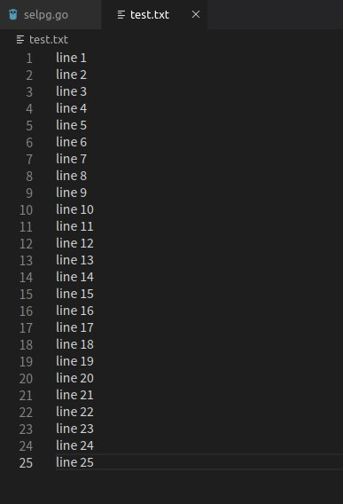  
#### selpg -s1 -e1 test.txt
测试基本参数  
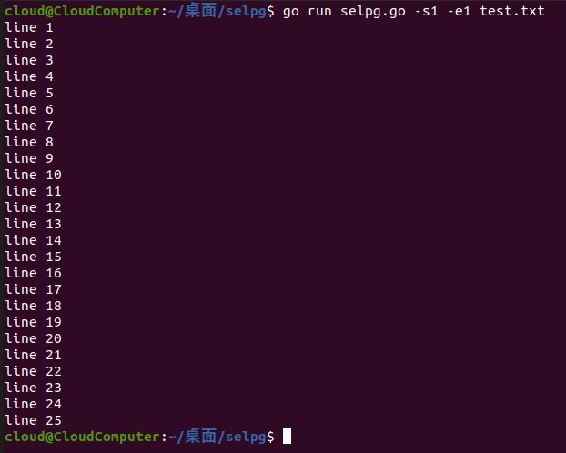  
#### selpg -s1 -e1 < test.txt
测试<符  
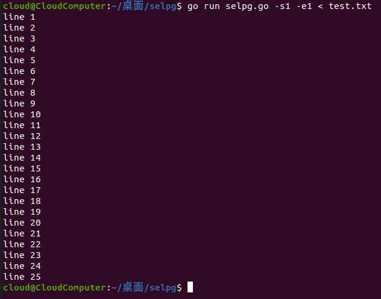  
#### cat test.txt | selpg -s1 -e1
测试管道输入到selpg程序  
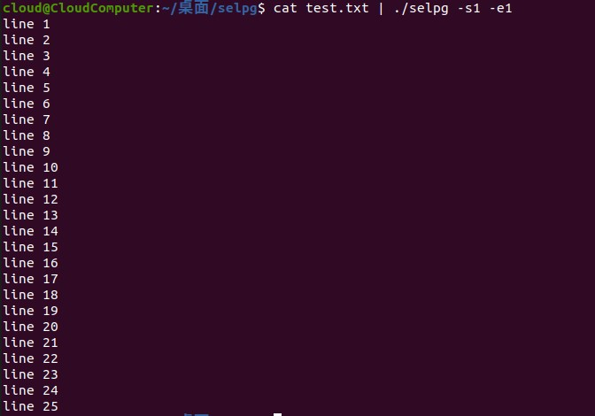  
#### selpg -s1 -e2 -l5 test.txt >output_file.txt
测试>符，将程序输出输出到output_file.txt文件中  
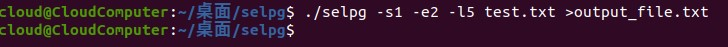  
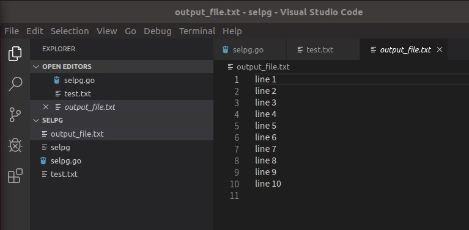    
output_file.txt
#### selpg -s10 -x > output_file.txt 2>error_file.txt
测试>符，将错误输出到error文件  
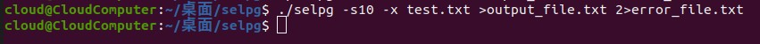  
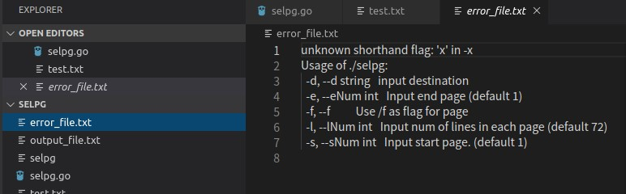  
error_file.txt  
#### selpg -s1 -e1 test.txt | cat
测试管道传输到下一个CLI应用  
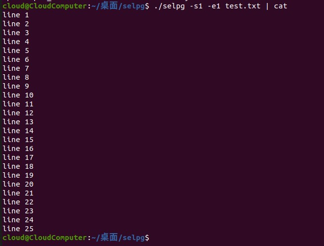  
#### selpg -s1 -e1 -f test.txt
测试-f  
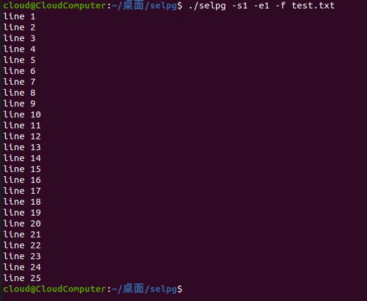  
#### selpg -s1 -e1 test.txt -dcat
测试-d（类似管道），不用lp测试改用cat测试  
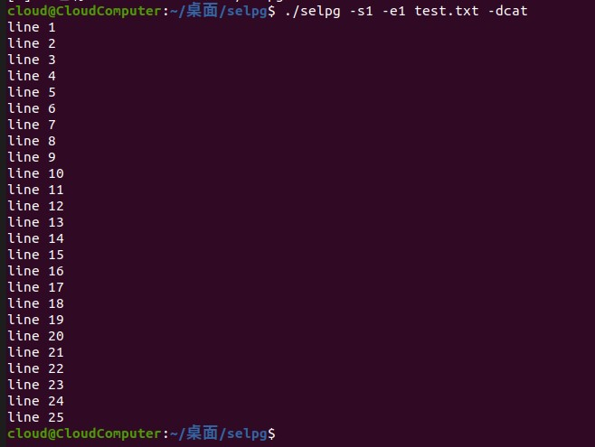  

