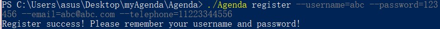
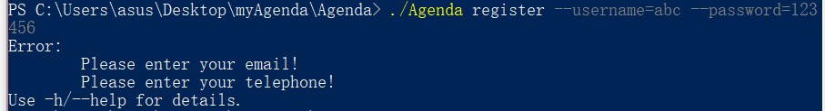
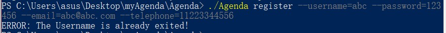
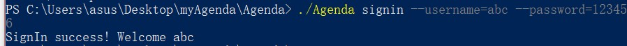
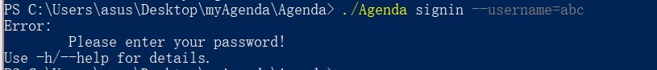
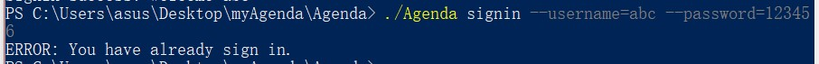
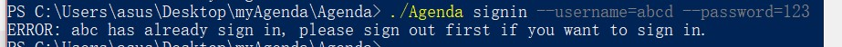
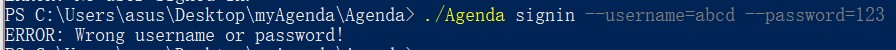
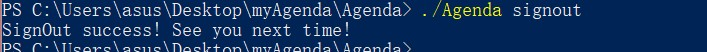
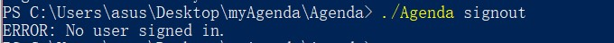

# Agenda

## 概览
使用cobra作为框架实现的会议管理命令行程序(阉割), 实现的功能:
- 用户注册
- 用户登陆
- 用户登出    
## 使用说明
1. 将仓库`clone`到本地,使用`go build`安装依赖(用go mod 管理环境)
2. 使用`go build -o Agenda.exe` 编译命令行程序Agenda

## 可用指令
  - 获得帮助: `./Agenda help`
  - 注册: `./Agenda register --user=USERNAME --password=PASSWORD --email=EMAIL --telephone=TELEPHONE` 
  - 登录: `./Agenda signin --user=USERNAME --password=PASSWORD`
  - 登出: `./Agenda signout `

## 用例
### 注册

 初次注册
 

 注册信息缺失
 

 用户已经存在
 

### 登录

 登录成功
 

 登录信息缺失
 

 重复登录当前用户
 

 当前已有其他用户登录
 

用户名或密码错误 
 

### 登出

登出

当前无用户登入，无法登出

