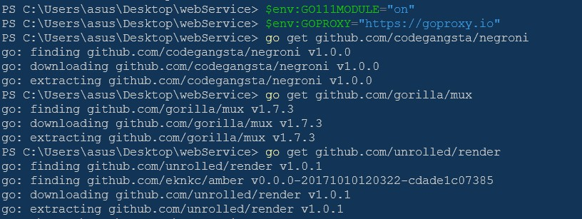
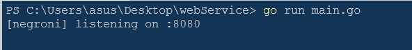
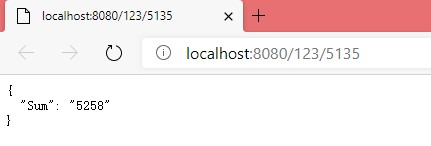
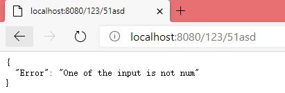
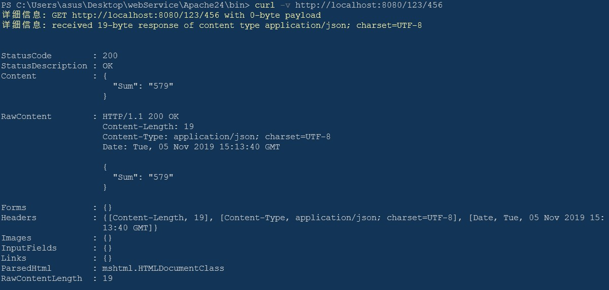
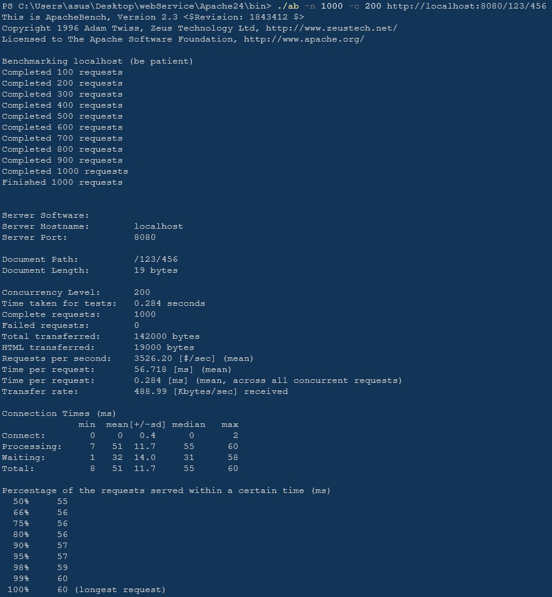

# 轻量级web服务搭建

## 运行环境
- windows10
- go: version go1.12.9 windows/amd64

## 选择框架
- codegangsta/negroni 服务器的框架，可以方便地使用其他小组件作为中间件
- gorilla/mux 使用其路由工具可以很方便地处理http请求的解析
- unrolled/render :方便将数据合成为符合模板格式的字符串,本次使用的是浏览器可以识别的JSON类型的请求数据

## 包的安装
<center></center>
## 运行以及浏览器测试
运行：
```
go run main.go
```
<center></center>

浏览器测试:
<center><br>123+5135结果</center><br>
<center><br>数据错误结果</center><br>

## curl测试
```
curl -v http://localhost:8080/123/456
```
<center><br>curl测试结果</center><br>

## ab压力测试
```
./ab -n 1000 -c 200 http://localhost:8080/123/456
```
<center><br>ab压力测试结果</center><br>

- 关键参数解释:
    - 输入参数
        - n:请求数量
        - c:并发数量
    - 输出结果
        - Concurrency Level 并发等级
        - Time taken for tests 用于测试的时间
        - Complete requests 完成请求数量
        - Failed requests 失败请求数量
        - Total transferred 总传输数据量
        - HTML transferred HTML传输数据量
        - Requests per second 每秒请求数
        - .....
